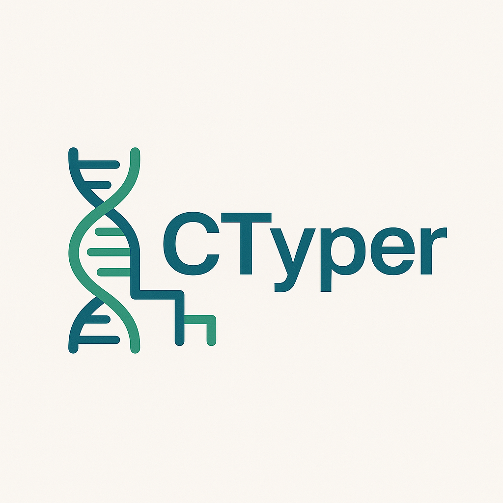

<a id="readme-top"></a>
<!--
*** Thanks for checking out the Best-README-Template. If you have a suggestion
*** that would make this better, please fork the repo and create a pull request
*** or simply open an issue with the tag "enhancement".
*** Don't forget to give the project a star!
*** Thanks again! Now go create something AMAZING! :D
-->


<!-- PROJECT SHIELDS -->
<!--
*** I'm using markdown "reference style" links for readability.
*** Reference links are enclosed in brackets [ ] instead of parentheses ( ).
*** See the bottom of this document for the declaration of the reference variables
*** for contributors-url, forks-url, etc. This is an optional, concise syntax you may use.
*** https://www.markdownguide.org/basic-syntax/#reference-style-links
-->


<!-- PROJECT LOGO -->
<br />
<div align="center">
  <a href="https://github.com/Walfred-MA/Ctyper">
    
  </a>

  <h3 align="center">ctyper</h3>

  <p align="center">
    A pangenome allele-specific and copy number specific genotyping tool
    <br />
    <a href="https://www.biorxiv.org/content/10.1101/2024.08.11.607269v1"><strong>Cite the paper»</strong></a>
    <br />
    <br />
    <a href="https://github.com/Walfred-MA/Ctyper/issues/new?labels=bug&template=bug-report---.md">Report Bug</a>
    ·
    <a href="https://github.com/Walfred-MA/Ctyper/issues/new?labels=enhancement&template=give-feedback---.md">Give Feedback</a>
     ·
    <a href="https://github.com/Walfred-MA/Ctyper/issues/new?labels=enhancement&template=ask-for-help---.md">Ask For Help</a>
     ·
    <a href="https://github.com/Walfred-MA/Ctyper/issues/new?labels=enhancement&template=suggest-genes---.md">Suggest include new genes</a>
  </p>
</div>

<!-- TABLE OF CONTENTS -->
## Table of Contents
1. [Getting Started](#getting-started)
2. [About ctyper](#about-ctyper)
3. [Repository Overview](#repository-overview)
4. [Prerequisites](#prerequisites)
5. [Inputs](#inputs)
6. [Installation](#installation)
7. [Usage](#usage)
8. [Results Annotation](#results-annotation)
9. [Results Visualization](#Results-visualization)
10. [Cohort Analysis](#cohort-analysis)
11. [License](#license)
12. [Contact](#contact)


<!-- Getting Started -->
# Getting Started with an example


<p align="right">(<a href="#readme-top">back to top</a>)</p>

<!-- ABOUT THE PROJECT -->
# About ctyper

Ctype is a command line tool to perform copy number sensitive versatile genotyping for NGS (Next-Generation Sequencing) data using pangenome database. It is designed to work on complex CNV (copy number variation) genes, but can also work as genotyping, local phasing or SV-calling tools for other genes. 

The results will be represented as pangenome alleles, which is defined as genic segments with locally phased variants that are combinatorially heritable mostly range in 15-50 kb, about the size of "Haplotype blocks" or "LD-blocks". The pangenome alleles are further classified as allele-types among populations, which are highly similar subgroups, and can be used to represent complex genetic variations such as structrual variations, gene conversion, duplication, translocation and etc. 

Ctyper is highly efficient, accurate and visualizable, thus allows high resolution large cohort association studies on complex CNV genes as well as complex genetic variations. 

<p align="right">(<a href="#readme-top">back to top</a>)</p>


<!-- GETTING STARTED -->
# Repository Overview

This repository includes the following components:

1. **Ctyper (src/)**  
   A C++ program for performing genotyping on NGS data.
2. **Auxiliary Analyze Tool (tools/Annotation/)**  
    Python tools to analyze genotyping results.
    - `tools/Annotation/SampleAnnotate.py`: Convert the raw output file to more interpretable table with annotations.
    - `tools/Annotation/Nomenclature/GenotypetoNomenclature.py`: Output the public nomenclatures from genotyping results. The nomenclatures annotation can be found at Data/all_nomenclature.txt.
    - `tools/Annotation/VCF/GenotypetoVCF.py`: Converting the genotyping results to VCF format. This requires Individual Sample Annotation Database (eg. PangenomeAlleles_annotationfix.v1.0.tsv). Note: this not recommended to be used in association studies, because of the limitation of VCF file on representing pangenome, but maybe used for locating known important variants.
      
4. **Visualization Tool (tools/Plot/)**  
   A Python tool for visualizing genotyping results using multiple sequence alignments.

5. **Cohort Analysis Tool (tools/Cohort/)**  
   A Python tool for summarizing results across all samples in a cohort study, including annotation information.

6. **Pangenome Allele Database**  
   A database required by ctyper for genotyping. Files: `HprcCpcHgsvc_final42_matrix.v1.0.txt` and `HprcCpcHgsvc_final42_matrix.v1.0.txt.index` available at [https://zenodo.org/records/13381931](https://zenodo.org/records/13381931).

7. **Population Analysis Annotation Database**  
   A database containing annotation information to support population-level analysis. File: `PangenomeAlleles_typefix.v1.0.tsv` available at [https://zenodo.org/records/13381931](https://zenodo.org/records/13381931).

8. **Individual Sample Annotation Database**  
   A comprehensive database with detailed annotations for individual pangenome alleles, supporting individual sample studies and visualization. File: `PangenomeAlleles_annotationfix.v1.0.tsv` available at [https://zenodo.org/records/13381931](https://zenodo.org/records/13381931).

9. **Additional Data Files (data/)**  
   - `backgrounds.list`: A list of k-mers used as backgrounds to determine NGS coverage if not predetermined.
   - `select_files.txt`: The catalog for all included genes and matrices, which can be used to locate the gene of interest.
   - `all_nomenclature.txt`: The public nomenclatures used by GenotypetoNomenclature.py, currently including HLAs, CYP2D6, and KIRs.  
     - **HLAs include**: HLA-A, HLA-B, HLA-C, HLA-DMA, HLA-DMB, HLA-DOA, HLA-DOB, HLA-DPA1, HLA-DPA2, HLA-DPB1, HLA-DPB2, HLA-DQA1, HLA-DQA2, HLA-DQB1, HLA-DQB2, HLA-DRA, HLA-E, HLA-F, HLA-G, HLA-H, HLA-J, HLA-K, HLA-L, HLA-N, HLA-P, HLA-S, HLA-T, HLA-U, HLA-V, HLA-W, HLA-Y.
     - **KIRs include**: KIR2DL1, KIR2DL2, KIR2DL3, KIR2DL4, KIR2DL5A, KIR2DL5B, KIR2DP1, KIR2DS1, KIR2DS2, KIR2DS3, KIR2DS4, KIR2DS5, KIR3DL1, KIR3DL2, KIR3DL3.

10. **Test Cases (tests/)**  
   Simple test cases for validating the tools and pipeline.


<!-- Prerequisites -->
# Prerequisites  
  
Ctyper is officially supported only in a **Linux** environment. Although it may run on UNIX-like system like MACOS as well, but we may not provide support for it.  

### Required Software

1. **GCC 8**
2. **Eigen Library**  
   [https://gitlab.com/libeigen/eigen](https://gitlab.com/libeigen/eigen)
3. **HTSlib**  
   [https://github.com/samtools/htslib](https://github.com/samtools/htslib)  
   Alternatively, you can install the entire Samtools package:  
   [https://github.com/samtools/samtools](https://github.com/samtools/samtools)

### Python Tools (Optional)

For additional Python tools, you need:

1. **Python 3.7+**
2. **NumPy**
3. **Pandas**  
   [https://pandas.pydata.org/](https://pandas.pydata.org/)
4. **Matplotlib**  
   [https://matplotlib.org/stable/install/index.html](https://matplotlib.org/stable/install/index.html)

  

<!-- Inputs-->
# Inputs  
  
Ctyper takes five types of files as input:  
  
1. **CRAM files** (`*.cram`) — must be indexed (recommended due to lower I/O intensity). 
2. **BAM files** (`*.bam`) — must be indexed.
3. **SAM files** (`*.sam`).
4. **FASTQ files** (`*.fastq`).
5. **FASTA files** (`*.fa`, `*.fasta`).
  
<!-- Installation -->
# Installation  
  
1. **Install all prerequisites.**
2. **Navigate to the `src/` directory:**

   ```bash
   cd src/
   ```

3. **Compile ctyper:**

   ```bash
   make
   ```

4. **Move ctyper to your installation folder:**

   ```bash
   mv ctyper /path/to/your/install/folder
   ```

5. **Download the pangenome allele database file** (we'll refer to it as `$Database`) **and its index file.**
6. **(Optional) Download the allele-type annotation file.**
7. **(Optional) Download the full alleles annotation file.**
8. **You're ready to go!**


<p align="right">(<a href="#readme-top">back to top</a>)</p>


<!-- USAGE EXAMPLES -->
# Usage

Ctyper requires:

1. **Input file(s)**
2. **Corresponding output file(s)**
3. **The pangenome allele database file** (must be indexed)
4. **Sequencing coverage information**, either by:
   - Providing background k-mers for ctyper to determine sequencing coverage (recommended)
   - Directly providing sequencing coverage information (useful when you don't have WGS data)

## Running Ctyper

Ctyper can process:

### 1. A Single File

Using background k-mers:

```bash
ctyper -i $Inputfile -m $Database -o $Outputfile -b background.list -n 1
```

Or providing sequencing coverage of 31-mers: 
31-mers = read_coverage * (read_length - 30) / read_length, for example a NGS at read coverage = 30, its 31-mers coverage is 30 * (150-30)/150  = 24.

```bash
ctyper -i $Inputfile -m $Database -o $Outputfile -d $sequencing_coverage -n 1
```

If you only interested in genes at certain region, for example chr1:100-1000

```bash
samtools view -b input.bam chr1:100-1000 -f 4 -o subset.bam
samtools sort -o sorted_input.bam input.bam
samtools index sorted_input.bam

ctyper -i sorted_input.bam -m $Database -o $Outputfile -d $sequencing_coverage -n 1
```


### 2. A Cohort of Files

Using background k-mers:

```bash
ctyper -I $AllInputs -m $Database -o $AllOutputs -b background.list -n $threads
```

Or providing sequencing coverage:

```bash
ctyper -I $AllInputs -m $Database -o $AllOutputs -D $All_sequencing_coverages -n $threads
```

- **$AllInputs**: A text file where each line is the path to an input file.
- **$AllOutputs**: A text file where each line is the output file corresponding to the input file (same line number).
- **$All_sequencing_coverages**: A text file where each line is the sequencing coverage information for the corresponding input file (same line number).

---

## Parameters

Supported parameters:

- **Help:**
  - `-h`: Print help information.

- **Inputs:**
  - `-i <string>`: Path to an individual input file.
  - `-I <string>`: Path to a file listing multiple input files (one per line).

- **Database:**
  - `-m <string>`: Path to the database file used for genotyping.
  - `-b <string>`: Path to the background k-mer list.

- **Coverage Information** (cannot be used with `-b`):
  - `-d <float>`: Sequencing coverage of the input file.
  - `-D <string>`: Path to a file listing sequencing coverages (one per input file, corresponding by line number).

- **Outputs:**
  - `-o <string>`: Path to the individual output file.
  - `-O <string>`: Path to a file listing multiple output files (one per input file, corresponding by line number).

- **Multithreading:**
  - `-n <int>`: Number of threads to use (default is 1).

- **Bias Correction:**
  - `-c <bool>`: Perform bias correction for Illumina data.


---

# Results Annotation

Here shows the commands to make the genotyping results interpretable:

1. **Summary the genotyping results into a table with annotation information**

   ```bash
   python tools/Annotation/SampleAnnotate.py -i $ctyper_outputs.txt -a PangenomeAlleles_annotationfix.tsv > genotype.txt
   ```

2. **(optional) Obtain public nomenclatures for important genes,including HLA, CYP2D6, and KIR**

   ```bash
   python tools/Annotation/Nomenclature/GenotypetoNomenclature.py -i genotype.txt -a data/all_nomenclature.txt > nomenclature.txt
   ```
3. **(optional) Convert genotyping results into VCF file**

   ```bash
   python tools/Annotation/VCF/GenotypetoVCF.py -i genotype.txt -o genotype.vcf
   ```

---
---

# Results Visualization

Visualization is performed on a **gene-by-gene** basis (not genome-wide).

For example, to visualize the gene **AMY1A**:

1. **Identify the gene group for AMY1A:**

   ```bash
   cat data/select_files.txt | grep -w "AMY1A" | cut -f2,3
   ```

   Output:

   ```
   newGeneCopies/AMY/AMY_partitions/AMY_group1_AMY1BOOOAMY1COOOAMY1A.fa	AMY1B,AMY1C,RNPC3,AMY1A,AMYP1,ACTG1P4,RP5-1108M17.5,AMY2B,AMY2A,
   ```

   This shows that **AMY1A** is in **AMY_group1**, along with other amylase genes.

2. **Extract the annotation for AMY_group1 from the full annotation table:**

   ```bash
   grep "^AMY_group1_" PangenomeAlleles_annotationfix.tsv > AMY_group1_annotationfix.tsv
   ```

3. **Extract the genotyping results for AMY_group1:**

   ```bash
   grep "^result: AMY_group1_" genotype.txt
   ```

   Output:

   ```
   result: AMY_group1_GW00031_h1_556,AMY_group1_GW00051_h2_891,
   ```

   The genotyping result is: `AMY_group1_GW00031_h1_556,AMY_group1_GW00051_h2_891`.

4. **Visualize the results:**

   ```bash
   python typemutant.py -i AMY_group1_annotationfix.tsv -n "AMY_group1_GW00031_h1_556,AMY_group1_GW00051_h2_891" -o output.png
   ```

**Optional:** To visualize the GENCODE annotation on the MSA:

1. **Obtain the GENCODE annotation:**

   ```bash
   grep "gene_name=AMY" genecode.gff3 > AMY.gff3
   ```

2. **Run the visualization with GENCODE annotation:**

   ```bash
   python typemutant.py -i AMY_group1_annotationfix.tsv -g AMY.gff3 -n "AMY_group1_GW00031_h1_556,AMY_group1_GW00051_h2_891," -o output.png
   ```


## Cohort Analysis

There are two scripts in the `tools/Cohort` folder that work together for cohort analysis.

1. **Download the allele-type annotation table:**

   ```
   PangenomeAlleles_typefix.tsv
   ```

2. **Run `CountAllele.py` on each sample to get allele-type results:**

   ```bash
   # For each result in $results
   for result in $results; do
       python CountAllele.py -i $result -t PangenomeAlleles_typefix.tsv -o "${result}_alleletype.out"
   done
   ```

   **Or**, to run in parallel:

   ```bash
   python CountAllele.py -f $results_folder/ -t PangenomeAlleles_typefix.tsv -n $numthreads
   ```

3. **Summarize results into a single file and add annotations:**

   ```bash
   python SummaryAlleles.py -f $results_folder/ -t PangenomeAlleles_typefix.tsv -o cohort_results.tsv
   ```

---


<!-- LICENSE -->
## License

Distributed under the MIT License. See `LICENSE.txt` for more information.

<p align="right">(<a href="#readme-top">back to top</a>)</p>


<!-- CONTACT -->
## Contact

Walfred MA - wangfeim@usc.edu
Mark Chaisson - mchaisso@usc.edu
<p align="right">(<a href="#readme-top">back to top</a>)</p>


